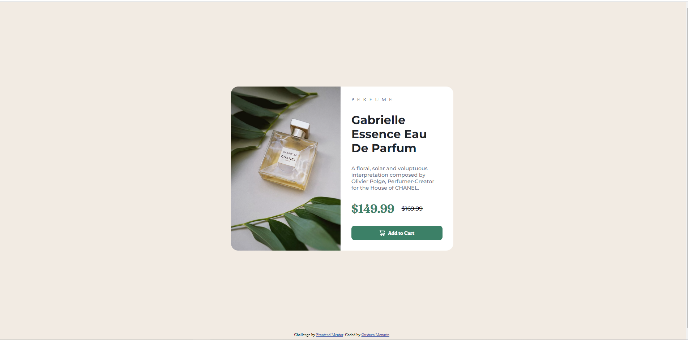

# Frontend Mentor - Solução de componente de cartão de visualização do produto

Esta é uma solução para o [desafio do componente do cartão de visualização do produto no Frontend Mentor](https://www.frontendmentor.io/challenges/product-preview-card-component-GO7UmttRfa). Os desafios do Frontend Mentor ajudam você a melhorar suas habilidades de codificação criando projetos realistas.

## Índice

- [Visão geral](#visão-geral)
  - [O desafio](#o-desafio)
  - [Captura de tela](#captura-de-tela)
  - [Links](#links)
- [Meu processo](#meu-processo)
  - [Construído com](#construído-com)
  - [O que aprendi](#o-que-aprendi)
  - [Desenvolvimento contínuo](#desenvolvimento-contínuo)
- [Autor](#autor)

**Observação: exclua esta nota e atualize o índice com base nas seções que você mantém.**

## Visão geral

### O desafio

Os usuários devem ser capazes de:

- Visualizar o layout ideal dependendo do tamanho da tela do dispositivo

### Captura de tela



### Links

- URL da solução: [Github](https://github.com/guhmonarin/product-preview-card-component-main)
- URL do site ao vivo: [Adicione o URL do site ao vivo aqui](https://your-live-site-url.com)

## Meu processo

### Construído com

- HTML5
- CSS
- Flexbox


### O que eu aprendi

Consegui entender e colocar em prática o uso do flexbox, que para determinados posições do elementos, ajuda bastante. Consegui também melhorar o uso da responsividade, transformando o layout para mobile.
``` css
.principal {
    background: var(--White);
    border-radius: 0 20px 20px 0;
    display: flex;
    flex-direction: column;
    justify-content: space-evenly;
    padding: 0 30px;
    height: 50%;
    width: calc(312.33px - 60px);
}

@media  screen and (max-width:650px) {
    .imagem__desktop {
        display: none;
    }

    .imagem__mobile {
        display: block;
        width: 420.30px;
        border-radius: 20px 20px 0 0;
    }
    
    .container {
        flex-direction: column;
        width: 100%;
        height: 97vh;
    }

    .principal {
        border-radius: 0 0 20px 20px;
        padding: 0 20px;
        width: 380.30px;
    }

}
```

### Desenvolvimento contínuo

Quero cada vez mais praticar o flexbox e o grid, que são ferramentas ideias do CSS, que nos ajudam cada vez mais criar layouts complexos e flexíveis, de uma forma simples.

## Autor

- Github - [Gustavo Monarin](https://github.com/guhmonarin)
- Linkedin- [Gustavo Monarin](https://www.linkedin.com/in/gustavo-monarin-652672127/)
